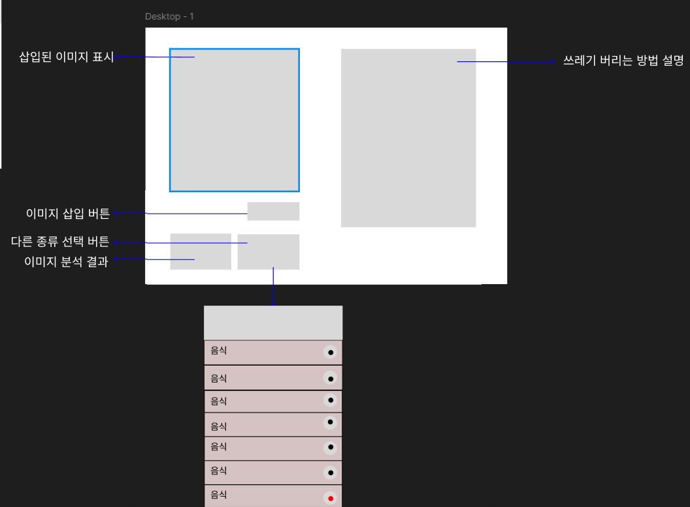

# recycle_project
- 분리수거가 어려운 사람들을 위한 분리수거 도우미 입니다.

## 계획
### 2025_06_22
- PyQt5를 사용해 UI 구현
- ResNet을 기반으로 직접 층을 쌓아 분류 모델을 구현
- 분리수거 방식 설명은 DB에서 직접 불러오기
- 추후에는 LLM과 RAG를 활용해 DB에 없는 정보를 외부에서 검색할 수 있게 설계

  

  메인화면 예시

 

### 2025_06_23
- 간단한 UI 화면 구성 완료

#### 고민
- 이미지를 업로드하고 분석하는 시간이 걸리기에 사용자가 선택할 수 있게 빠르고 정확도가 낮은 모델을 사용할 지 느리고 정확도가 높은 모들을 사용할 지 선택하는 방식 고려
- 결국엔 웹이 아닌 스마트폰이 목표이기에 너무 무거운 모델은 사용하기 어려움